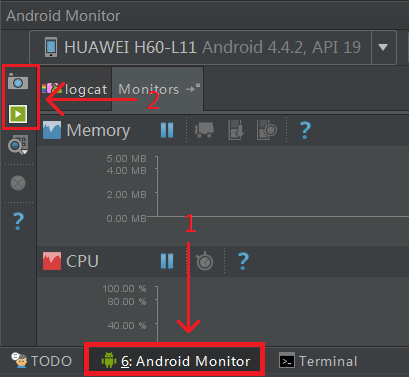

# 录屏与GIF制作

## 说明
在实际工作或学习过程中，很多地方都需要展示一些过程，或者展示动态的效果，使用视频显得比较大了，而且也不利于分享，故使用GIF就是一种很好的方法，体积小，易于分享展示。

## 制作GIF的方法
> 此处大部分参考自 廖祜秋(我们的秋百万大哥) 整理的内容： [Make GIF Snapshot for Android APP](http://www.liaohuqiu.net/posts/make-gif-for-android-app/)

制作GIF一般分为以下两种情况：

类别 | 说明 | 备注
--- | --- |  ---
第一种 | 在电脑上可以看到效果 | 在模拟器中运行的app，视频等
第二种 | 在手机上可以看到效果 | 在真机中运行的app

### 第一种的制作方法
第一种方法比较容易直接录制屏幕然后转换为GIF就行了，有很多可视化的制作软件，这里推荐几种:

名称 | 说明 | 地址
  ---  |   ---  |   ---
都叫兽GIF | 可视化GIF制作工具，支持录制后再次编辑，不同程度压缩，添加水印等功能，但默认右下角有一个都叫兽的水印，不适合强迫症患者  | [都叫兽GIF](http://www.reneelab.com.cn)<br/>[Windows直接下载](http://www.reneelab.com.cn/download-center/renee-gifer)
LICEcap | 可视化GIF制作工具，支持编辑录制区域大小，可改变录制帧率，功能没有上面多，但用起来很简单 | [LICEcap](http://www.cockos.com/licecap/)<br/>[Windows直接下载](http://www.cockos.com/licecap/licecap123-install.exe) 
ezgif | 在线制作GIF的工具，这个的功能也很强大，支持将多张图片合成为GIF，将视频转换为GIF，剪切旋转等多种操作 | [ezgif](http://ezgif.com/)

## 第二种的制作方法
虽然手机上也有一些录屏GIF制作软件，但是大部分都很渣，很难达到我们想要的效果。

我个人一般是将操作过程录制下来，然后发送到电脑上，用电脑软件截取GIF，也就是转为第一种方法。

### 录制手机操作的方法

#### 通过AndroidStudio录屏工具：

这个用起来很方便，录制后能直接保存在电脑上。



1.选到该选项卡

2.上面一个按钮是截屏，下面一个按钮是录屏。

#### 通过ADB命令：

作为一个程序猿，虽然可视化操作很爽，但不会两条命令怎么能装逼呢。下面就教大家如何用命令录屏。

``` shell
$ adb shell                                       // 进入shell
shell@ $ screenrecord --verbose /sdcard/demo.mp4  // 开始录制(保存到内存卡上)
(press Ctrl-C to stop)                            // 按Ctrl+C结束录制
shell@ $ exit                                     // 结束录制
$ adb pull /sdcard/demo.mp4                       // 将内存卡中的文件传到电脑上
```
**[更多ADB命令看这里](http://developer.android.com/tools/help/shell.html#screenrecord)**

#### 通过Python命令录制

虽说是Python命令，但是底层调用的依旧是adb，内部实现依赖了ffmpeg。

**详情请参考RoboGif的文档->[RoboGif](https://github.com/GcsSloop/RoboGif)**

如果你对Python还不了解，可以到这里学习一下Python的基础知识：**[PythonNote](https://github.com/GcsSloop/PythonNote)**


